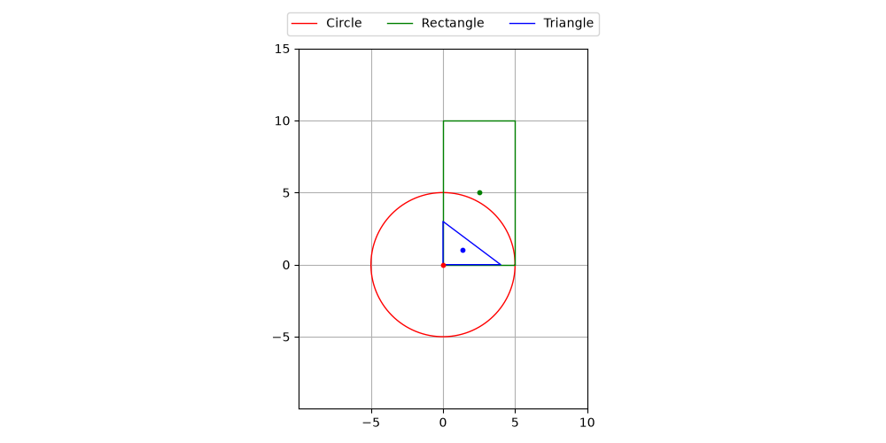
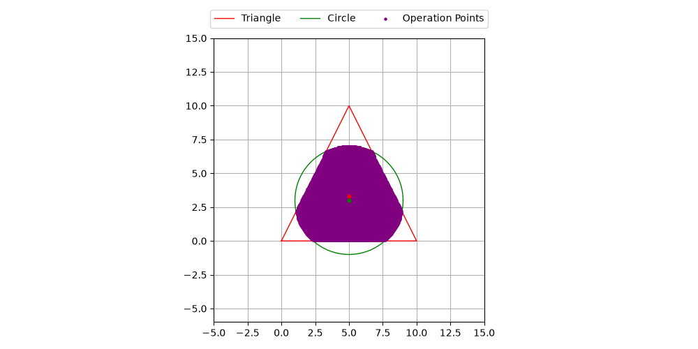

# Домашние задания по предмету "ООП и комп. инжинеринг"


*Task1*: визуализация геометрических фигур и логических операций над ними.

##  Описание

Программа реализует:
- Создание геометрических фигур (прямоугольник, круг, треугольник)
- Вычисление площадей и центров фигур
- Визуализацию фигур на плоскости
- Логические операции над фигурами: **объединение**, **пересечение**, **разность**

## Архитектура

```text
OOP-university/
├── task1/
│   ├── images/
│   │   ├── example_1.png
│   │   └── example_2.png
│   ├── figures.py
│   └── ...
── README.md


## Примеры визуализации

Ниже представлены примеры работы программы при построении фигур и выполнении логических операций:

### Пример 1: Исходные фигуры


### Пример 2: Результат логических операций


